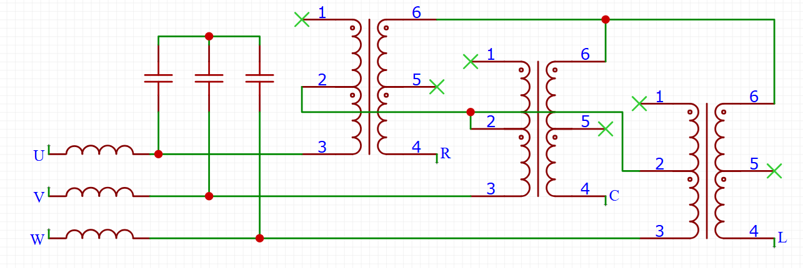

FOC-Stim is an implementation of the [Restim](https://github.com/diglet48/restim) threephase signal generation algorithm
for the [B-G431B-ESC1](https://www.st.com/en/evaluation-tools/b-g431b-esc1.html) electronic speed controller.

FOC stands for Field Oriented Control, an algorithm for controlling motors, referencing the intended purpose of the hardware.

It utilizes MRAC (model reference adaptive control) to generate consistent current-controlled waveforms
as environment conditions change.

Powered by SimpleFOC.

# Hardware setup

BOM:

* B-G431B-ESC1
* USB cable and 12v
* 3x transformer (XICON 42TU200-RC suggested)
* 3x inductor (220µH - 470µH)
* 3x ceramic caps (10µF 50v)

When selecting an inductor, look for saturation current about 1A and flat inductance-current curve in the datasheet. Some options:
* KEMET SBCP-11HY221H to SBCP-11HY471H. 80HY or 14HY series also a possibility.
* Fastron 09HVP or 09HCP series.
* Coilcraft RFB0810 or RFB1010 or RFS1317 series
* Coilcraft DR0608-224L, usable if cramped for space

A panel-mount USB micro-B is useful if you want to make this into a nice box.
[USB Micro-B](https://www.sparkfun.com/products/15464)
or [USB B](https://www.sparkfun.com/products/15463).

How to wire:

`U`, `V`, `W` are the 3 outputs on the board, with `U` being the one closest to the potentiometer.

# Software setup

Install Visual Studio Code with plugins `platformio` and `teleplot`.  
Firmware should compile and upload without problems.

Inspect `FOC-Stim/src/config.h` to configure the current limits.

# Control

Control over serial with Restim.

View live stats with teleplot.

All restim features are supported except: vibration.